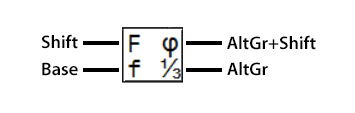
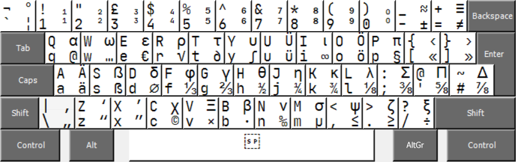
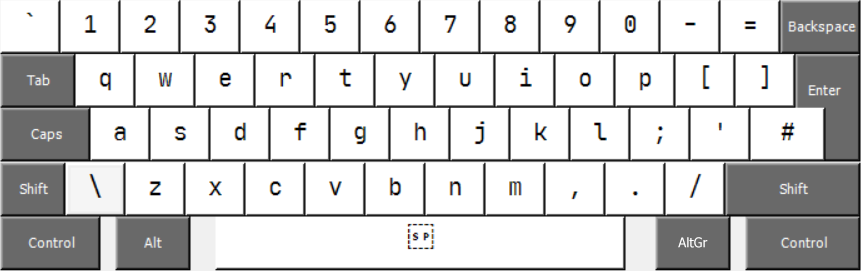
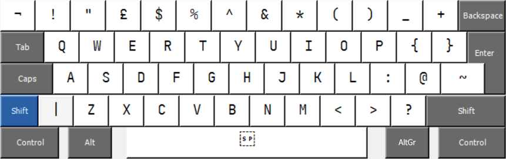
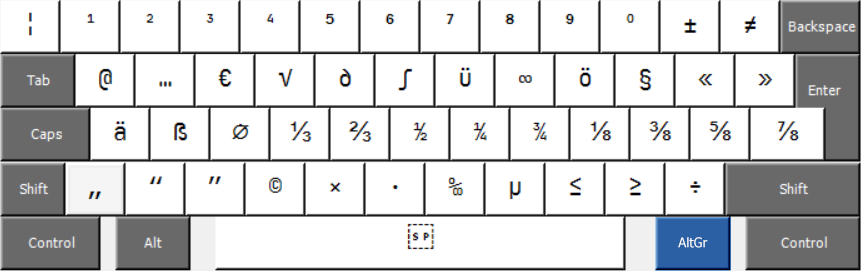
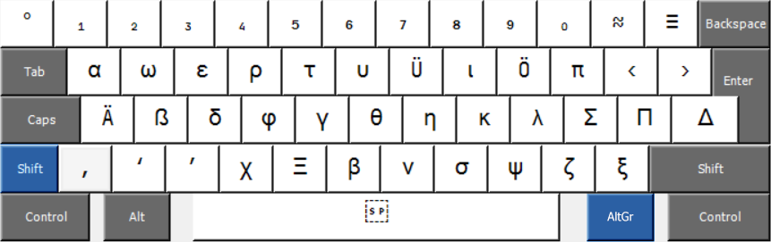

Keyboard Layout "United Kingdom plus German and Math"
=====================================================

This is a keyboard layout that extends the regular United Kingdom layout by German Umlaute and various special characters, including many math symbols and some Greek letters.

Description
-----------

**Note:**
This layout is meant for 105+ key keyboards (as used in the UK and many other countries, with a small left *Shift* key and a tall *Enter* key), not for ANSI (US, 104 key) keyboards.

The base layer (no modifiers pressed) and the *Shift* layer coincide with the regular United Kingdom layout.

The **AltGr layer** (can be accessed with *Alt+Ctrl* on keyboards that don't have an *AltGr* key) features:
* Various symbols needed to type in German: Umlaute ä ö ü (on *AltGr+A/O/U*), the "sharp S" ß (on *AltGr+S*), and German quotation marks „ ” (on *AltGr+\\* and *AltGr+X*).
* The symbols @ (on *AltGr+Q*), € (on *AltGr+E*), and μ (on *AltGr+M*) as on the German keyboard layout.
* Superscript Numbers: ¹ ² ³ ⁴ ⁵ ⁶ ⁷ ⁸ ⁹ ⁰ (On *AltGr+1/.../0*)
* Fractions: ⅓ ⅔ ½ ¼ ¾ ⅛ ⅜ ⅝ ⅞ (on *AltGr+F/.../#*)
* Various other symbols: ± ≠ … √ ∂ ∫ ∞ § « » ⌀ “ © × · ‰ ≤ ≥ ÷

The **AltGr+Shift layer** (can be accessed with *Alt+Ctrl+Shift* on keyboards that don't have an *AltGr* key) features:
* Capital Umlaute Ä Ö Ü (on *AltGr+Shift+A/O/U*) and the seldom-used capital "sharp S" ẞ (on *AltGr+Shift+S*),
* Subscript Numbers: ₁₂₃₄₅₆₇₈₉₀ (On *AltGr+Shift+1/.../0*)
* Most lowercase Greek letters: α ω ε ρ τ υ ι π ẞ δ φ γ θ η κ λ χ β ν σ ψ ζ ξ
* Some capital Greek letters: Σ Π Δ Ξ
* Various other symbols: ° ≈ ≡ ‹ › ‚ ‘ ’

For more information on which symbol is mapped to which key, see the [images](#images) and [tables](#tables) below.

Installation
------------

In order to install the keyboard layour, proceed as follows:

* Click on the latest release in the sidebar of this page.
* Download the archive `enGB_DEM_setup.zip`.
* Extract the contents of this archive to a location on your computer.
* Run `setup.exe`.

In order to select this keyboard layout, proceed as follows:

* Open the windows settings.
* Click on "Time & Language"
* Select "Language" from the sidebar.
* Click the keyboard icon.
* In the dropdown menu for "Override for default input method", select "United Kingdom plus German and Math".

Compiling / Modifying the layout
--------------------------------

If you want to compile (or modify) the layout yourself, proceed as follows.

* The file [enGB_DEM.klc](enGB_DEM.klc) can be opened with Microsoft Keyboard Layout Creator (MSKLC).

* Download and install Microsoft Keyboard Layout Creator (MSKLC) Version 1.4 (<https://www.microsoft.com/en-us/download/details.aspx?id=102134>).

  **Note:**
  MSKLC should be installed to a location whose path does not contain any spaces.
  Otherwise, bugs may occur.

  Bad: `C:\Program Files (x86)\Microsoft Keyboard Layout Creator`

  Good: `D:\MKLC`

* Open the file `enGB_DEM.klc` with MSKLC.

* Make any changes to the layout.
  Potentially rename it (`Project > Properties...`).

* Build the installer by clicking `Project > Build DLL and Setup Package`.

  **Note:** The warnings that will appear can be ignored. (They come from non-ASCII symbols being mapped to keys, symbols being mapped to the key that is exclusive to ISO keyboards, and the `@` symbol being mapped to two different keys.)

Images
------

Legend:\

*All layers*

*Base layer*

*Shift layer*

*AltGr (Alt+Ctrl) layer*

*AltGr+Shift (Alt+Ctrl+Shift) layer*

Tables
------

### All layers – Symbol table

| Key | Normal | Shift | AltGr | AltGr+Shift |
|-----|--------|-------|-------|-------------|
| 1   | 1      | !     | ¹     | ₁           |
| 2   | 2      | "     | ²     | ₂           |
| 3   | 3      | £     | ³     | ₃           |
| 4   | 4      | $     | ⁴     | ₄           |
| 5   | 5      | %     | ⁵     | ₅           |
| 6   | 6      | ^     | ⁶     | ₆           |
| 7   | 7      | &     | ⁷     | ₇           |
| 8   | 8      | *     | ⁸     | ₈           |
| 9   | 9      | (     | ⁹     | ₉           |
| 0   | 0      | )     | ⁰     | ₀           |
| Q   | q      | Q     | @     | α           |
| W   | w      | W     | …     | ω           |
| E   | e      | E     | €     | ε           |
| R   | r      | R     | √     | ρ           |
| T   | t      | T     | ∂     | τ           |
| Y   | y      | Y     | ∫     | υ           |
| U   | u      | U     | ü     | Ü           |
| I   | i      | I     | ∞     | ι           |
| O   | o      | O     | ö     | Ö           |
| P   | p      | P     | §     | π           |
| A   | a      | A     | ä     | Ä           |
| S   | s      | S     | ß     | ẞ           |
| D   | d      | D     | ⌀     | δ           |
| F   | f      | F     | ⅓     | φ           |
| G   | g      | G     | ⅔     | γ           |
| H   | h      | H     | ½     | θ           |
| J   | j      | J     | ¼     | η           |
| K   | k      | K     | ¾     | κ           |
| L   | l      | L     | ⅛     | λ           |
| Z   | z      | Z     | “     | ‘           |
| X   | x      | X     | “     | ’           |
| C   | c      | C     | ©     | χ           |
| V   | v      | V     | ×     | Ξ           |
| B   | b      | B     | ·     | β           |
| N   | n      | N     | ‰     | ν           |
| M   | m      | M     | μ     | σ           |
|\`¬¦ |\`      | ¬     | ¦     | °           |
|`-_` | -      | _     | ±     | ≈           |
|`=+` | =      | +     | ≠     | ≡           |
|`[{` | [      | {     | «     | ‹           |
|`]}` | ]      | }     | »     | ›           |
|`;:` | ;      | :     | ⅜     | Σ           |
|`'@` | '      | @     | ⅝     | Π           |
|`#~` | #      | ~     | ⅞     | Δ           |
|`\\|`| \      |\|     | „     | ‚           |
|`,<` | ,      | <     | ≤     | ψ           |
|`.>` | .      | >     | ≥     | ζ           |
|`/?` | /      | ?     | ÷     | χ           |

### Base layer (no modifier)

| Key | Symbol | Number | Unicode name         | Note                          |
|-----|--------|--------|----------------------|-------------------------------|
| 1   | 1      | U+0031 | Digit One            |                               |
| 2   | 2      | U+0032 | Digit Two            |                               |
| 3   | 3      | U+0033 | Digit Three          |                               |
| 4   | 4      | U+0034 | Digit Four           |                               |
| 5   | 5      | U+0035 | Digit Five           |                               |
| 6   | 6      | U+0036 | Digit Six            |                               |
| 7   | 7      | U+0037 | Digit Seven          |                               |
| 8   | 8      | U+0038 | Digit Eight          |                               |
| 9   | 9      | U+0039 | Digit Nine           |                               |
| 0   | 0      | U+0030 | Digit Zero           |                               |
| Q   | q      | U+0071 | Latin Small Letter Q |                               |
| W   | w      | U+0077 | Latin Small Letter W |                               |
| E   | e      | U+0065 | Latin Small Letter E |                               |
| R   | r      | U+0072 | Latin Small Letter R |                               |
| T   | t      | U+0074 | Latin Small Letter T |                               |
| Y   | y      | U+0079 | Latin Small Letter Y |                               |
| U   | u      | U+0075 | Latin Small Letter U |                               |
| I   | i      | U+0069 | Latin Small Letter I |                               |
| O   | o      | U+006F | Latin Small Letter O |                               |
| P   | p      | U+0070 | Latin Small Letter P |                               |
| A   | a      | U+0061 | Latin Small Letter A |                               |
| S   | s      | U+0073 | Latin Small Letter S |                               |
| D   | d      | U+0064 | Latin Small Letter D |                               |
| F   | f      | U+0066 | Latin Small Letter F |                               |
| G   | g      | U+0067 | Latin Small Letter G |                               |
| H   | h      | U+0068 | Latin Small Letter H |                               |
| J   | j      | U+006A | Latin Small Letter J |                               |
| K   | k      | U+006B | Latin Small Letter K |                               |
| L   | l      | U+006C | Latin Small Letter L |                               |
| Z   | z      | U+007A | Latin Small Letter Z |                               |
| X   | x      | U+0078 | Latin Small Letter X |                               |
| C   | c      | U+0063 | Latin Small Letter C |                               |
| V   | v      | U+0076 | Latin Small Letter V |                               |
| B   | b      | U+0062 | Latin Small Letter B |                               |
| N   | n      | U+006E | Latin Small Letter N |                               |
| M   | m      | U+006D | Latin Small Letter M |                               |
|\`¬¦ |\`      | U+0060 | Grave Accent         | Backtick                      |
|`-_` | -      | U+002D | Hyphen-Minus         |                               |
|`=+` | =      | U+003D | Equals Sign          |                               |
|`[{` | [      | U+005B | Left Square Bracket  |                               |
|`]}` | ]      | U+005D | Right Square Bracket |                               |
|`;:` | ;      | U+003B | Semicolon            |                               |
|`'@` | '      | U+0027 | Apostrophe           | This is not \` or ´ or ‘ or ’ |
|`#~` | #      | U+0023 | Number Sign          | Hashtag                       |
|`\\|`| \\     | U+005C | Reverse Solidus      | Backslash                     |
|`,<` | ,      | U+002C | Comma                |                               |
|`.>` | .      | U+002E | Full Stop            | Period                        |
|`/?` | /      | U+002F | Solidus              | Slash                         |

### Shift layer

| Key | Symbol | Number | Unicode name           | Note               |
|-----|--------|--------|------------------------|--------------------|
| 1   | !      | U+0021 | Exclamation Mark       |                    |
| 2   | "      | U+0022 | Quotation Mark         | This is not “ or ” |
| 3   | £      | U+00A3 | Pound Sign             |                    |
| 4   | $      | U+0024 | Dollar Sign            |                    |
| 5   | %      | U+0025 | Percent Sign           |                    |
| 6   | ^      | U+005E | Circumflex Accent      |                    |
| 7   | &      | U+0026 | Ampersand              |                    |
| 8   | *      | U+002A | Asterisk               |                    |
| 9   | (      | U+0028 | Left Parenthesis       |                    |
| 0   | )      | U+0029 | Right Parenthesis      |                    |
| Q   | Q      | U+0051 | Latin Capital Letter Q |                    |
| W   | W      | U+0057 | Latin Capital Letter W |                    |
| E   | E      | U+0045 | Latin Capital Letter E |                    |
| R   | R      | U+0052 | Latin Capital Letter R |                    |
| T   | T      | U+0054 | Latin Capital Letter T |                    |
| Y   | Y      | U+0059 | Latin Capital Letter Y |                    |
| U   | U      | U+0055 | Latin Capital Letter U |                    |
| I   | I      | U+0049 | Latin Capital Letter I |                    |
| O   | O      | U+004F | Latin Capital Letter O |                    |
| P   | P      | U+0050 | Latin Capital Letter P |                    |
| A   | A      | U+0041 | Latin Capital Letter A |                    |
| S   | S      | U+0053 | Latin Capital Letter S |                    |
| D   | D      | U+0044 | Latin Capital Letter D |                    |
| F   | F      | U+0046 | Latin Capital Letter F |                    |
| G   | G      | U+0047 | Latin Capital Letter G |                    |
| H   | H      | U+0048 | Latin Capital Letter H |                    |
| J   | J      | U+004A | Latin Capital Letter J |                    |
| K   | K      | U+004B | Latin Capital Letter K |                    |
| L   | L      | U+004C | Latin Capital Letter L |                    |
| Z   | Z      | U+005A | Latin Capital Letter Z |                    |
| X   | X      | U+0058 | Latin Capital Letter X |                    |
| C   | C      | U+0043 | Latin Capital Letter C |                    |
| V   | V      | U+0056 | Latin Capital Letter V |                    |
| B   | B      | U+0042 | Latin Capital Letter B |                    |
| N   | N      | U+004E | Latin Capital Letter N |                    |
| M   | M      | U+004D | Latin Capital Letter M |                    |
|\`¬¦ | ¬      | U+00AC | Not Sign               |                    |
|`-_` | _      | U+005F | Low Line               | Underscore         |
|`=+` | +      | U+002B | Plus Sign              |                    |
|`[{` | {      | U+007B | Left Curly Bracket     |                    |
|`]}` | }      | U+007D | Right Curly Bracket    |                    |
|`;:` | :      | U+003A | Colon                  |                    |
|`'@` | @      | U+0040 | Commercial At          | Also on `AltrGr+Q` |
|`#~` | ~      | U+007E | Tilde                  |                    |
|`\\|`|\|      | U+007C | Vertical Line          | Bar, Pipe          |
|`,<` | <      | U+003C | Less-Than Sign         |                    |
|`.>` | >      | U+003E | Greater-Than Sign      |                    |
|`/?` | ?      | U+003F | Question Mark          |                    |

### AltGr layer (or, equivalently, Alt+Ctrl)

| Key | Symbol | Number | Unicode name                               | Note    |
|-----|--------|--------|--------------------------------------------|---------|
| 1   | ¹      | U+00B9 | Superscript One                            |         |
| 2   | ²      | U+00B2 | Superscript Two                            |         |
| 3   | ³      | U+00B3 | Superscript Three                          |         |
| 4   | ⁴      | U+2074 | Superscript Four                           |         |
| 5   | ⁵      | U+2075 | Superscript Five                           |         |
| 6   | ⁶      | U+2076 | Superscript Six                            |         |
| 7   | ⁷      | U+2077 | Superscript Seven                          |         |
| 8   | ⁸      | U+2078 | Superscript Eight                          |         |
| 9   | ⁹      | U+2079 | Superscript Nine                           |         |
| 0   | ⁰      | U+2070 | Superscript Zero                           |         |
| Q   | @      | U+0040 | Commercial At                              | Also on Shift+' |
| W   | …      | U+2026 | Horizontal Ellipsis                        |         |
| E   | €      | U+20AC | Euro Sign                                  |         |
| R   | √      | U+221A | Square Root                                |         |
| T   | ∂      | U+2202 | Partial Differential                       |         |
| Y   | ∫      | U+222B | Integral                                   |         |
| U   | ü      | U+00FC | Latin Small Letter U with Diaeresis        | Umlaut u|
| I   | ∞      | U+221E | Infinity                                   |         |
| O   | ö      | U+00F6 | Latin Small Letter O with Diaeresis        | Umlaut o|
| P   | §      | U+00A7 | Section Sign                               |         |
| A   | ä      | U+00E4 | Latin Small Letter A with Diaeresis        | Umlaut a|
| S   | ß      | U+00DF | Latin Small Letter Sharp S                 |         |
| D   | ⌀      | U+2300 | Diameter Sign                              | This is not ∅`U+2205` or Ø`U+00D8` or ø`U+00F8` |
| F   | ⅓      | U+2153 | Vulgar Fraction One Third                  |         |
| G   | ⅔      | U+2154 | Vulgar Fraction Two Thirds                 |         |
| H   | ½      | U+00BD | Vulgar Fraction One Half                   |         |
| J   | ¼      | U+00BC | Vulgar Fraction One Quarter                |         |
| K   | ¾      | U+00BE | Vulgar Fraction Three Quarters             |         |
| L   | ⅛      | U+215B | Vulgar Fraction One Eight                  |         |
| Z   | “      | U+201C | Left Double Quotation Mark                 | English left quotation mark |
| X   | “      | U+201d | Right Double Quotation Mark                | German/English right quotation mark |
| C   | ©      | U+00A9 | Copyright Sign                             |         |
| V   | ×      | U+00D7 | Multiplication Sign                        |         |
| B   | ·      | U+00B7 | Middle Dot                                 |         |
| N   | ‰      | U+2030 | Per Mille Sign                             |         |
| M   | μ      | U+03BC | Greek Small Letter Mu                      | Sign for 'micro' |
|\`¬¦ | ¦      | U+00A6 | Broken Bar                                 |         |
|`-_` | ±      | U+00B1 | Plus-Minus Sign                            |         |
|`=+` | ≠      | U+2260 | Not Equal To                               |         |
|`[{` | «      | U+00AB | Left-Pointing Double Angle Quotation Mark  | French quotation mark |
|`]}` | »      | U+00BB | Right-Pointing Double Angle Quotation Mark | French quotation mark |
|`;:` | ⅜      | U+215C | Vulgar Fraction Three Eights               |         |
|`'@` | ⅝      | U+215D | Vulgar Fraction Five Eights                |         |
|`#~` | ⅞      | U+215E | Vulgar Fraction Seven Eights               |         |
|`\|` | „      | U+201E | Double Low-9 Quotation Mark                | German left quotation mark |
|`,<` | ≤      | U+2264 | Less-Than or Equal To                      |         |
|`.>` | ≥      | U+2265 | Greater-Than or Equal To                   |         |
|`/?` | ÷      | U+00F7 | Division Sign                              |         |

### AltGr+Shift layer (or, equivalently, Alt+Ctrl+Shift)

| Key | Symbol | Number | Unicode name                               | Note    |
|-----|--------|--------|--------------------------------------------|---------|
| 1   | ₁      | U+2081 | Subscript One                              |         |
| 2   | ₂      | U+2082 | Subscript Two                              |         |
| 3   | ₃      | U+2083 | Subscript Three                            |         |
| 4   | ₄      | U+2084 | Subscript Four                             |         |
| 5   | ₅      | U+2085 | Subscript Five                             |         |
| 6   | ₆      | U+2086 | Subscript Six                              |         |
| 7   | ₇      | U+2087 | Subscript Seven                            |         |
| 8   | ₈      | U+2088 | Subscript Eight                            |         |
| 9   | ₉      | U+2089 | Subscript Nine                             |         |
| 0   | ₀      | U+2080 | Subscript Zero                             |         |
| Q   | α      | U+03B1 | Greek Small Letter Alpha                   |         |
| W   | ω      | U+03C9 | Greek Small Letter Omega                   |         |
| E   | ε      | U+03B5 | Greek Small Letter Epsilon                 |         |
| R   | ρ      | U+03C1 | Greek Small Letter Rho                     |         |
| T   | τ      | U+03C4 | Greek Small Letter Tau                     |         |
| Y   | υ      | U+03C5 | Greek Small Letter Upsilon                 |         |
| U   | Ü      | U+00DC | Latin Capital Letter U with Diaeresis      | Umlaut U|
| I   | ι      | U+03B9 | Greek Small Letter Iota                    |         |
| O   | Ö      | U+00D6 | Latin Capital Letter O with Diaeresis      | Umlaut O|
| P   | π      | U+03C0 | Greek Small Letter Pi                      |         |
| A   | Ä      | U+00C4 | Latin Capital Letter A with Diaeresis      | Umlaut A|
| S   | ẞ      | U+1E9E | Latin Capital Letter Sharp S               |         |
| D   | δ      | U+03B4 | Greek Small Letter Delta                   |         |
| F   | φ      | U+03C6 | Greek Small Letter Phi                     |         |
| G   | γ      | U+03B3 | Greek Small Letter Gamma                   |         |
| H   | θ      | U+03B8 | Greek Small Letter Theta                   |         |
| J   | η      | U+03B7 | Greek Small Letter Eta                     |         |
| K   | κ      | U+03BA | Greek Small Letter Kappa                   |         |
| L   | λ      | U+03BB | Greek Small Letter Lamda                   |         |
| Z   | ‘      | U+2018 | Left Single Quotation Mark                 | English left quotation mark |
| X   | ’      | U+2019 | Right Single Quotation Mark                | German/English right quotation mark |
| C   | χ      | U+03C7 | Greek Small Letter Chi                     |         |
| V   | Ξ      | U+039E | Greek Capital Letter Xi                    |         |
| B   | β      | U+03B2 | Greek Small Letter Beta                    |         |
| N   | ν      | U+03BD | Greek Small Letter Nu                      |         |
| M   | σ      | U+03C3 | Greek Small Letter Sigma                   |         |
|\`¬¦ | °      | U+00B0 | Degree Sign                                |         |
|`-_` | ≈      | U+2248 | Almost Equal To                            |         |
|`=+` | ≡      | U+2261 | Identical To                               |         |
|`[{` | ‹      | U+2039 | Single Left-Pointing Angle Quotation Mark  | French quotation mark |
|`]}` | ›      | U+203A | Single Right-Pointing Angle Quotation Mark | French quotation mark |        |
|`;:` | Σ      | U+03A3 | Greek Capital Letter Sigma                 | This is not ∑ `U+2211` |
|`'@` | Π      | U+03A0 | Greek Capital Letter Pi                    | This is not ∏ `U+220F` |
|`#~` | Δ      | U+0394 | Greek Capital Letter Delta                 |         |
|`\|` | ‚      | U+201A | Single Low-9 Quotation Mark                | German left quotation mark |
|`,<` | ψ      | U+03C8 | Greek Small Letter Psi                     |         |
|`.>` | ζ      | U+03B6 | Greek Small Letter Zeta                    |         |
|`/?` | ξ      | U+03BE | Greek Small Letter Xi                      |         |

License
-------

Copyright 2020-2022 Sebastian Muskalla

This keyboard layout is free and open software, licensed under the MIT License, see [LICENSE](LICENSE)
